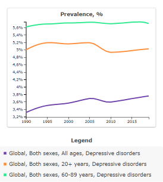
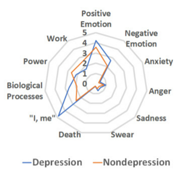

  <h1>EDA para la elaboración de un Modelo predictivo de clasificación del riesgo de sufrir depresión en usuarios de redes sociales </h1>
  <h2>Manipulación y Análisis de datos con Pandas y Python</h2>

 
  

## Introducción al documento

El contenido de este documento son **apuntes teoricos y prácticos** y un proyecto de **ANÁLISIS EXPLORATORIO DE DATOS** para **USUARIO DE REDES SOCIALES** del Curso de **Python para el Análisis de datos** y busca ser una guía para futuros trabajos personales. El mismo está dictado por Edwin Escobedo, Data Scientist del team [Data Science Research Perú](https://www.datascience.pe/).

Pandas es la librería de software libre para manipulación de datos con Python más usada. Manipula grandes sets de datos numéricos, tablas y series de tiempo. Trabaja con múltiples formatos de archivos de datos como csv o xls.

## Objetivos del documento

- Ejecutar operaciones básicas de Pandas.
- Comprender el significado y uso de los DataFrames en Análisis de Datos e Ciencia de Datos.
- Usar Computational Tools de Pandas para realizar cálculos básicos.
- Trabajar con Statisticals tools.
- Hacer preprocesamiento de datos para crea un modelo predictivo por desarrollar podría detectar de manera oportuna si una persona es depresiva, tomando en consideración el sentimiento de soledad, estrés, falta de concentración, fatiga, además del uso de redes sociales. 
- Extraer información del Data Set realizada a usuarios de redes sociales durante catorce días para fines prácticos.
- Abrir camino a que la persona encuestada pueda optar por ayuda profesional, e incluso realizar más estudios sobre el nivel de depresión que se encuentra para una pronta ayuda idónea.

## Tabla de contenido
- [Resumen](#Resumen)
- [I. Introducción](#Introducción)
- [II. Definición del problema](#Definición-del-problema)
  - [A. Usuarios de redes sociales](#Usuarios-de-redes-sociales)
  - [B. Transtornos depresivos](#Transtornos-depresivos)
- [III. Trabajos relacionados](#Trabajos-relacionados)
  - [A. Social Media and Depression Symptoms: A Network Perspective](#Social-Media-and-Depression-Symptoms-A-Network-Perspective)
  - [B. Metodología de Análisis de Emociones para Identificar Riesgo de Cometer Suicidio Generado por el COVID-19](#Metodología-de-Análisis-de-Emociones-para-Identificar-Riesgo-de-Cometer-Suicidio-Generado-por-el-COVID-19)
  - [C. Monitoreo de las tendencias de depresión en Twiter durante la pandemia de COVID-19: Estudio observacional](#Monitoreo-de-las-tendencias-de-depresión-en-Twiter-durante-la-pandemia-de-COVID-19-Estudio-observacional)
- [IV. Propuesta de Data Product](#Propuesta-de-Data-Product)
  - [A. Set de datos]
  - [B. Modelamiento y/o análisis]
- [V. Beneficios](#Beneficios)
- [VI. Plan de proyecto](#Plan-de-proyecto)
- [VII. Análisis de datos](#Análisis-de-datos)
  - [A. Limpieza de datos]
  - [B. Análisis univariante]
    - [Categórico]
    - [Numérico]
  - [C. Análisis multivariante]
  - [D. Eliminación de Outliers]
  - [E. Matriz de Correlación]
    - [Categórica]
    - [Numérica]
  - [F. Codificación de variables]
  - [G. Escalamiento de variables]
  - [H. Experimentación]
    - [Sin balanceo]
    - [Con balanceo]
- [VIII. Referencias](#Referencias)

## Resumen

Este documento presenta el análisis exploratorio de un dataset resultante de encuesta realizada a usuarios de redes sociales durante catorce días, con la intención de identificar hallazgos importantes en relación al riesgo de sufrir depresión, luego de limpiar y clasificar la data en mención.

**Palabras claves—Modelo predictivo, procesamiento de datos, depresión, redes sociales, salud mental**

## Introducción

Las redes sociales han llegado a ser parte de la vida de las personas, ya que con ellas se ha obtenido una herramienta para fomentar la cercanía entre ellas, ya sea por intereses en común o para expresar opiniones.
Hasta enero de 2022 se sabe que entre las redes sociales con mayor interacción están Facebook con 2 900 millones de usuarios, e Instagram con 1 478 millones de usuarios, asimismo se prevé un crecimiento de usuarios de Twiter hasta el 2025, siendo estas redes sociales donde se publican diversos comentarios.
 Entre los usuarios de estas redes sociales se encuentran quienes sufren de depresión, lo cual, como se muestra en la “Fig. 1”, se estima que afecta aproximadamente al 3,8% de la población, de los cuales el 5,7% son los mayores de 20 años, y el 5,7% son mayores de 60 años.

 
  
  
<i>Fig. 1.	Resultados del estudio Global Burden of Disease (GBD) de 2019 referente a la depresión.</i>

Se tomará un conjunto de datos basado en las respuestas dadas por usuarios de redes sociales, durante catorce días, en donde cuantificaba su estado de ánimo de 0 a 100, con la determinación de realizar hallazgos sobre los sentimientos que resultan predictores a un posible riesgo de sufrir depresión.

## Definición del problema

### Usuarios de redes sociales

Si bien hay diversos conjuntos de datos disponibles para analizar a los usuarios con tendencia a depresión, se les ha estado generalizando sin considerar a fondo las características de cada uno.
Una evaluación recurrente es la del procesamiento del lenguaje natural (NLP) y el aprendizaje automático, para lo cual se transforma los datos de texto no estructurado, como comentarios de usuarios en redes sociales, en datos numéricos estructurados.
Sin embargo, extraer información de personas con el fin de rastrear la depresión es una desventaja evaluarlo de la manera descrita, puesto a que se trata a todos los involucrados como si tuvieran el mismo perfil.
Ante ello se opta por encuesta realizada a cada individuo, en el cual se cuantifica del 0 al 100 los sentimientos de este, y así, en base al análisis de estos determinar si tiene tendencia a la depresión.

### Transtornos depresivos

Frente a un episodio depresivo la persona presenta dificultades en diversos ámbitos de su vida incluyendo su entorno social, y puede expresarlo a través de las redes sociales, ya sea con algún comentario no tan comprometedor, o realizando publicaciones recurrentes que den a notar su sentir depresivo.
Los tipos de episodios depresivos pueden ser leves, moderados o graves, en función de los síntomas que tenga la persona.
Entre los trastornos del estado de ánimo se encuentran los que se dan una sola vez, los recurrentes y los bipolares que tienen episodios eufóricos e irritables. Tomando en consideración los diversos estados de ánimo que puede tener una persona, se busca a través de la encuesta medirlos para llegar a una conclusión más acertada.

## Trabajos relacionados

### Social Media and Depression Symptoms *A Network Perspective*

Destaca su enfoque en el uso pasivo de las redes sociales, como lo es desplazarse por las noticias en las redes sociales, y cómo esto se relaciona con los síntomas de depresión.

### Metodología de Análisis de Emociones para Identificar Riesgo de Cometer Suicidio Generado por el COVID-19

Su objetivo es proponer y evaluar una nueva metodología tomando como fundamento el análisis de emociones para calcular masivamente la presencia de indicios de suicidio en usuarios de Twiter, haciendo uso del modelo supervisado y no supervisado.

### Monitoreo de las tendencias de depresión en Twiter durante la pandemia de COVID-19 *Estudio observacional*

Basado en un método de búsqueda de expresiones regulares de usuarios identificados con depresión, creando un clasificado de texto psicológico consiguiendo, como se visualiza en “Fig. 2”, perfiles lingüísticos de los Tweets de usuarios depresivos y no depresivos.

 
  
  
<i>Fig. 2.	Perfiles lingüísticos de los Tweets depresivos y no depresivos.</i>

### Tipos de Variables que componen un data frame

[Notebook del contenido](https://github.com/francomanca93/analisis-de-datos/blob/funcionalidades-basicas/2-Funcionalidades-basicas-de-pandas/7_Tipos_de_datos.ipynb)

En esta sección se estudia cual es la **rutina de preprocesamiento de datos** con la que debemos comenzar a analizar un dataframe. Vamos a estudiar la composicion de las diferentes formatos de variables que podemos encontrar en un dataframe. 

Vamos a utiilzar [Google DataSearch](https://datasetsearch.research.google.com/) para buscar datasets. Utilizaremos un dataset de meteoritos de la NASA llamado [Meteorite Landings](https://data.nasa.gov/Space-Science/Meteorite-Landings/gh4g-9sfh).

### Estructuras de dataframes en detalle

[Notebook del contenido](https://github.com/francomanca93/analisis-de-datos/blob/funcionalidades-basicas/2-Funcionalidades-basicas-de-pandas/7_Tipos_de_datos.ipynb)

En esta sección estudiamos en detalle las diferentes variables que podemos encontrar en un mismo dataframe. Estas pueden ser categoricas, de tiempo, tipo texto, numericos (float e int).

**Una ventaja de trabajar con variables categoricas es que reducimos el tamaño de uso de la memoria RAM y el tamaño del archivo en si.**

### Borrar filas, columnas y copiar información

[Notebook del contenido](https://github.com/francomanca93/analisis-de-datos/blob/funcionalidades-basicas/2-Funcionalidades-basicas-de-pandas/7_Tipos_de_datos.ipynb)

En esta sección estudiamos como borrar los registros de un dataframe usando la función drop. 

Tambien aprenderemos como copiar correctamete un dataframe para trabajar con él. En la rutina de preprocesamiento de datos es muy importante que se mantenga la fuente de datos original.

## Aplicando pandas

## London bike sharing dataset

Utilizaremos un dataframe descargado de [kaggle](https://www.kaggle.com/), el mismo se llama [London bike sharing dataset](https://www.kaggle.com/hmavrodiev/london-bike-sharing-dataset) para estudiar funciones matemáticas, funciones complejas y lambdas aplicados a datasets.

### Funciones matemáticas

[Notebook de contenido](https://github.com/francomanca93/analisis-de-datos/blob/aplicaciones/3-Aplicando-pandas/8_Funciones_matem%C3%A1ticas.ipynb)

En esta sección se estudia como hacer **operaciones matematicas** en un dataframe, tambien a realizar **operaciones entre diferentes columnas** de un mismo dataframe y utilizar funciones matematicas de otra libreria como **numpy**.

Utilizamos un dataframe descargado de [kaggle](https://www.kaggle.com/), el mismo se llama [London bike sharing dataset](https://www.kaggle.com/hmavrodiev/london-bike-sharing-dataset).

### Funciones más complejas y lambdas

[Notebook de contenido](https://github.com/francomanca93/analisis-de-datos/blob/aplicaciones/3-Aplicando-pandas/8_Funciones_matem%C3%A1ticas.ipynb)

En esat sección el objetivo es aprender a usar **funciones** mucho mas **avanzadas** (**creandolas**) en el dataframe utilizando **.apply()** y **lambda**. 

En esta sección seguimos utilizando el dataset [London bike sharing dataset](https://www.kaggle.com/hmavrodiev/london-bike-sharing-dataset).

## Population dataset

Utilizamos un dataset descargado de [world bank](https://data.worldbank.org/), buscamos [population](https://data.worldbank.org/indicator/SP.POP.TOTL), con el estudiaremos **múltiples índices**.

### Múltiples índices

[Notebook de contenido](https://github.com/francomanca93/analisis-de-datos/blob/aplicaciones/3-Aplicando-pandas/9_Multiples_indices.ipynb)

En esta seccion aprendemos a como trabajar un dataframe con **múltiples índices**. 

Un **índice** es un artificio que nos permite en pandas encontrar la ubicación de un archivo o dato. Son las coordenadas en una dataframe.

La ventajas de utilizar multiples índices es que podemos aplicar **funciones matemáticas en diversos niveles**.

Utilizamos un dataframe descargado de [world bank](https://data.worldbank.org/), buscamos [population](https://data.worldbank.org/indicator/SP.POP.TOTL).

## Datasets propios

En las siguientes secciones se crearán datasets para el fin con el cual se estudien. Veremos **como trabajar con variables de tipo texto**, **concatenación**, **merge**, **datos faltantes**.

### Como trabajar con variables de tipo texto en Pandas

[Notebook de contenido](https://github.com/francomanca93/analisis-de-datos/blob/aplicaciones/3-Aplicando-pandas/10_Variables_tipo_texto.ipynb)

Pandas cuenta con una gran funcionalidad a la hora de interactuar con texto, es super versatil si uno esta interesado en crear modelos de análisis de lenguaje natural.

Cuando queremos manejar texto utilizamos la función **.str** y con esta podemos concatenar otros métodos para **hacer mayúsculas o minúsculas todo el texto**, y otras funcionalidades. Podemos **contar los caracteres** del string o **separar por palabras**. Tambien podemos **buscar coincidencias** y **crear filtros**. Inclusive podemos utilizar **expresiones regulares** para realizar busquedas mas complejas y exhaustivas.

### Concatenación de DataFrames, concat y append

[Notebook de contenido](https://github.com/francomanca93/analisis-de-datos/blob/aplicaciones/3-Aplicando-pandas/11_Concatenacion_de_DataFrames.ipynb)

En este notebook se estudia como unir dos dataframes en uno solo. Esto es muy usual cuando se hace análisis de datos y a estos solo los podemos obtener en pequeños paquetes. Utilizando la función **for y append** podemos unirlos en unos solo rapidamente.

Aprenderemos a como **concatenar vectores y matrices con numpy**, **concatenar filas y columnas (series) con pandas**, y como **concatenar dataframe con pandas**, esta última con **.concat()** y **.append()**.

### Merge de DataFrames

[Notebook de contenido](https://github.com/francomanca93/analisis-de-datos/blob/aplicaciones/3-Aplicando-pandas/12_Merge_de_DataFrames.ipynb)

Aprenderemos a como unificar dos dataframe utilizamos parámetros en común utilizando la función **merge**. En merge veremos atributos como **inner**, **left**, **right**, **outer**.

En general cuando un **cientifico de datos** analiza muchas fuentes de información, las cuales son ideales unificarlas a través de los parámetros en común. Los conceptos relacionados con merge que se verán en **pandas** funciona exactamente igual en **SQL**

En una base de datos, las tablas están o deben estar correlacionadas con llaves primarias y secundarias.

### Lidiar con datos faltantes en DataFrames

[Notebook de contenido](https://github.com/francomanca93/analisis-de-datos/blob/aplicaciones/3-Aplicando-pandas/13_Datos_faltantes_DataFrames.ipynb)

Es muy común que nuestros DataFrames presenten datos faltantes, por eso en esta sección veremos como procesar nuestros **datos faltantes** en  DataFrames y en qué consisten los **objetos NaN** (Not a Number).

### Cómo lidiar con datos duplicados en Pandas 

[Notebook de contenido](https://github.com/francomanca93/analisis-de-datos/blob/aplicaciones/3-Aplicando-pandas/15_Datos_duplicados_DataFrames.ipynb)

Es muy usual que los registros de una base de datos aparezcan más de una vez, así que en esta sección veremos cómo pandas puede ayudarnos a lidiar con estos casos. Utilizaremos funciones como **duplicated()** y **diferentes parámetros** que esta puede tomar para trabajar con datos duplicados.

## Diamond dataset

Vamos a utilizar una base de datos que se encuentra en una importante libreria de visualizacion de datos, **seaborn**. La misma se llama **diamonds dataset** para estudiar **groupby**.

### Group by

[Notebook de contenido](https://github.com/francomanca93/analisis-de-datos/blob/aplicaciones/3-Aplicando-pandas/14_Group_by.ipynb)

En esta sección aprenderemos a como agrupar nuestro dataframe **bajo una categoria** y sobre esta aplicar algunas **funciones estadísticas**. Tambien aprenderemos a **crear nuestra propia función y agregarla al estudio**.

Vamos a utilizar una base de datos que se encuentra en una importante libreria de visualizacion de datos, **seaborn**. La misma se llama **diamonds**, es una base de datos que muestra diferentes caracteristicas de diamantes como quilates, tipo de corte, color, claridad, precio y dimensiones.

## Tips dataset

El dataset sobre el que trabajaremos es sobre **tips (propinas)**, de la librería **seaborn**. Con el estudiaremos **groupby**, **refozando su uso** y **extrayendo valor de variables categoricas**, y **tablas dinámicas**.

### Group by - Refozando su uso 

[Notebook de contenido](https://github.com/francomanca93/analisis-de-datos/blob/aplicaciones/3-Aplicando-pandas/16_Group_by_Extrayendo_valor_con_variables_categ%C3%B3ricas.ipynb)

En esta sección veremos nuevamente Group by y rezorzaremos con otro dataframe el uso de esta función. Veremos como agrupar nuetro dataframe bajo una categoria y sobre esta aplicar algunas funciones estadísticas. 

Lo principal de esta sección es como **extraer valor** de las **variables numericas** con las funcion **groupby** y **aggregate**, usando categorias. 

El dataset sobre el que trabajaremos es sobre **propinas**, de la librería **seaborn**. En él aparecen parámetros sobre la cuenta, la propina que dieron las personas, si fue un hombre o mujer, si era fumador, tambien si como era el día (soleado, nublado, etc), el horario de la misma (desayuno, almuerzo, cena, etc) y cuantas personas compartian la comida. 

### Group by - extraer valor con variables categóricas

[Notebook de contenido](https://github.com/francomanca93/analisis-de-datos/blob/aplicaciones/3-Aplicando-pandas/16_Group_by_Extrayendo_valor_con_variables_categ%C3%B3ricas.ipynb)

En la seccion anterior se aprendio como **extraer valor** de las **variables numericas** con las funcion groupby y aggregate, usando categorias. 

En esta seccion se vera como **extraer valor** de los datos  de las **variables categoricas**.

Haremos **conteo** y un **analisis** con las **variables categoricas**, aplicaremos funciones **lambdas**, **transformaremos** **variables numericas en categorica**, y **extraeremos valor** de estos datos nuevos creados.

### Tablas dinámicas con Pivot Table

[Notebook de contenido](https://github.com/francomanca93/analisis-de-datos/blob/aplicaciones/3-Aplicando-pandas/16_Group_by_Extrayendo_valor_con_variables_categ%C3%B3ricas.ipynb)

En esta sección veremos como crear **tablas dinámicas**. Para eso pandas cuenta con una función llamada **pivot_table**, esta nos permite extraer, cuando tenemos variables categoricas, gran informacion y valor de nuestro dataframe.

## COVID-19 dataset

Se utilizará una base de dato que tiene información sobre el **coronavirus**. La misma la podemos encontrar en el siguiente enlace a la base de datos de [covid-19](https://www.kaggle.com/sudalairajkumar/novel-corona-virus-2019-dataset?select=covid_19_data.csv). Con él estudiaremos **series de tiempo**, como manejar **variables nulas** es estas series y como **visualizar y graficar datos**.

### Series de Tiempo

[Notebook de contenido](https://github.com/francomanca93/analisis-de-datos/blob/aplicaciones/3-Aplicando-pandas/17_Series_de_tiempo_y_visualizacioes.ipynb)

En las lecturas previas se aprendio a como trabajar con **variables nulas** y a como darle formato a las **variables de tipo tiempo**. 

En esta sección se vera como utilizar las herramientas anteriores y como trabajar con **series de tiempo**. Daremos **formato de tiempo** a una columna y la tomaremos como **indice de nuestro dataframe**, agruparemos un nuevo dataframe del inicial usando **groupby**, **agregaremos datos faltantes** y finalmente extraeremos **valor estadístico** de nuestro dataframe.

Se utilizará una base de dato que tiene información sobre el **coronavirus**. La misma la podemos encontrar en el siguiente enlace a la base de datos de [covid-19](https://www.kaggle.com/sudalairajkumar/novel-corona-virus-2019-dataset?select=covid_19_data.csv).

### Series de Tiempo - variables nulas

[Notebook de contenido](https://github.com/francomanca93/analisis-de-datos/blob/aplicaciones/3-Aplicando-pandas/17_Series_de_tiempo_y_visualizacioes.ipynb)

Vamos a ver en mas profundidad las **variables nulas** y como trabajar con ellas. 

Tambien trabajaremos con **graficos simples**. Utilizaremos herramientas de pandas para hacer analisis de series de tiempo, **como agrupar** cuando tenemos columnas de tipo tiempo, utilizando una función llamada **Grouper** y veremos la importancia de trabajar con **intervalos de tiempo** y calcular **suavizados de curvas**, usando **rolling()**.

En general en la naturaleza haremos este tipo de analisis por ejemplo en:
* temperaturas a lo largo de un año.
* cuando realizamos proyecciones financieras.
* en nuestro caso, analisis de casos de COVID-19 a lo largo del tiempo desde que comenzo.

### Visualización y graficación de datos 

[Notebook de contenido](https://github.com/francomanca93/analisis-de-datos/blob/aplicaciones/3-Aplicando-pandas/17_Series_de_tiempo_y_visualizacioes.ipynb)

Tomaremos los datos de un **pais determinado** y **analizaremos sus casos** gracias a groupby. Luego **graficaremos** utilizando diferentes [**plot de pandas**](https://pandas.pydata.org/docs/reference/api/pandas.DataFrame.plot.html?highlight=plot) y matplotlib.

## Proyecto - Cambio climático

[Notebook del proyecto](https://github.com/francomanca93/analisis-de-datos/blob/proyecto/Proyecto_Cambio_clim%C3%A1tico.ipynb)

En este proyecto juntaremos diversas bases de datos para hacer un estudio del cambio climatico. Las bases de datos que utilizaremos son las siguientes:

* Base datos que habla sobre el cambio climático, [Global Land Temperature by Country](https://www.kaggle.com/berkeleyearth/climate-change-earth-surface-temperature-data?select=GlobalLandTemperaturesByCountry.csv)
* Cantidad de emision de CO2 en kilotones, [CO2 (kt)](https://data.worldbank.org/indicator/EN.ATM.CO2E.KT).
* Cantidad de bosques deforestados en km2, [Forest (km2)](https://data.worldbank.org/indicator/AG.LND.FRST.K2).
* Cantidad de agricultura por pais en km2, [Agricultura (km2)](https://data.worldbank.org/indicator/AG.LND.AGRI.K2).
* La poblacion de cada uno de los paises, [Population (7mM)](https://data.worldbank.org/indicator/SP.POP.TOTL).
* Cantidad de energia electrica consumida en kWh per capita, [Electric power consumption (kWh per capita)](https://data.worldbank.org/indicator/EG.USE.ELEC.KH.PC).

### Iniciando una rutina típica de manejo de datos

En este proyecto se verá como analizar los datasets mediante una rutina practica en donde utilizaremos las funciones aprendidas. 

En esta primer instancia utilizaremos el dataset [Global Land Temperature by Country](https://www.kaggle.com/berkeleyearth/climate-change-earth-surface-temperature-data?select=GlobalLandTemperaturesByCountry.csv).

Una vez obtenidos los datos hay que hacer preprocesamiento y limpieza de datos, hay que consolidar los archivos en una base simple para analisis y extraer los insight. Para los insights utilizaremos siempre gráficas.

### Preprocesamiento de datos - terminando de preparar y limpiar los datasets

En esta segunda instancia utiilzaremos datasets relacionados con el cambio climatico. Podemos encontrar todos los datasets en el siguiente enlace, [Topic](https://data.worldbank.org/topic/climate-change). 

Los los que utilizaremos son: [CO2 (kt)](https://data.worldbank.org/indicator/EN.ATM.CO2E.KT), [forest (km2)](https://data.worldbank.org/indicator/AG.LND.FRST.K2), [agricultura (km2)](https://data.worldbank.org/indicator/AG.LND.AGRI.K2), [population (7mM)](https://data.worldbank.org/indicator/SP.POP.TOTL) y [electric power consumption (kWh per capita)](https://data.worldbank.org/indicator/EG.USE.ELEC.KH.PC).

En esta sección se realizará el preprocesamiento de datos de los datasets mencionados, esto va desde **preparar los datasets**, **limpiarlos**, **transformarlos** y **unificarlos**. Este es el trabajo que nos lleva mas tiempo.

Normalmente este trabajo para un cientifico de datos lleva a consumir entre un **60% y 70% del tiempo de trabajo**. Luego de esto viene la parte mas interesante, el **análisis**.

### Análisis de datos

Lo que se hizo fue preparar una serie de dataframes y condensarlos en uno solo, listo para ser analizado. En esta sección veremos diversas funciones de pandas que nos permiten **extraer insight** de una forma muy rápida. 

Se estudia como **graficar diferentes variables en un unico gráfico**, como podemos ver la **correlacion entre variables** con un **heatmap** o mapa de colores, observaremos las **correlaciones con scatter plot** o graficos de puntos y finalmente es estudiarán **grafico de coordenadas paralelas**, para **comparar diferentes variables**. 
