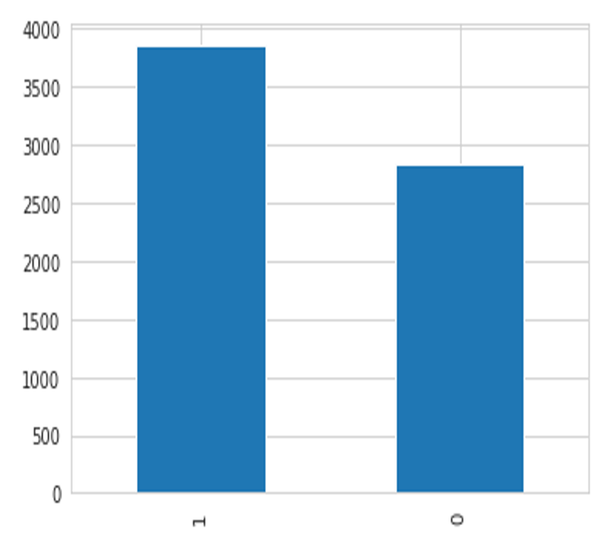

<div align="center">
  <h1>EDA para la elaboración de un Modelo predictivo de clasificación del riesgo de sufrir depresión en usuarios de redes sociales </h1>
  <h2>Manipulación y Análisis de datos con Pandas y Python</h2>
</div>

<div align="center"> 
  
</div>

## Introducción al documento

El contenido de este documento son **apuntes teoricos y prácticos** y un proyecto de **ANÁLISIS EXPLORATORIO DE DATOS** para **USUARIO DE REDES SOCIALES** del Curso de **Python para el Análisis de datos** y busca ser una guía para futuros trabajos personales. El mismo está dictado por Edwin Escobedo, Data Scientist del team [Data Science Research Perú](https://www.datascience.pe/).

Pandas es la librería de software libre para manipulación de datos con Python más usada. Manipula grandes sets de datos numéricos, tablas y series de tiempo. Trabaja con múltiples formatos de archivos de datos como csv o xls.

## Objetivos del documento

- Ejecutar operaciones básicas de Pandas.
- Comprender el significado y uso de los DataFrames en Análisis de Datos e Ciencia de Datos.
- Usar Computational Tools de Pandas para realizar cálculos básicos.
- Trabajar con Statisticals tools.
- Hacer preprocesamiento de datos para crea un modelo predictivo por desarrollar podría detectar de manera oportuna si una persona es depresiva, tomando en consideración el sentimiento de soledad, estrés, falta de concentración, fatiga, además del uso de redes sociales. 
- Extraer información del Data Set realizada a usuarios de redes sociales durante catorce días para fines prácticos.
- Abrir camino a que la persona encuestada pueda optar por ayuda profesional, e incluso realizar más estudios sobre el nivel de depresión que se encuentra para una pronta ayuda idónea.


## Tabla de contenido
- [Resumen](#Resumen)
- [I. Introducción](#Introducción)
- [II. Definición del problema](#Definición-del-problema)
  - [A. Usuarios de redes sociales](#Usuarios-de-redes-sociales)
  - [B. Transtornos depresivos](#Transtornos-depresivos)
- [III. Trabajos relacionados](#Trabajos-relacionados)
  - [A. Social Media and Depression Symptoms: A Network Perspective](#Social-Media-and-Depression-Symptoms-A-Network-Perspective)
  - [B. Metodología de Análisis de Emociones para Identificar Riesgo de Cometer Suicidio Generado por el COVID-19](#Metodología-de-Análisis-de-Emociones-para-Identificar-Riesgo-de-Cometer-Suicidio-Generado-por-el-COVID-19)
  - [C. Monitoreo de las tendencias de depresión en Twiter durante la pandemia de COVID-19: Estudio observacional](#Monitoreo-de-las-tendencias-de-depresión-en-Twiter-durante-la-pandemia-de-COVID-19-Estudio-observacional)
- [IV. Propuesta de Data Product](#Propuesta-de-Data-Product)
  - [A. Set de datos](#Set-de-datos)
  - [B. Modelamiento y/o análisis](#Modelamiento-y-análisis)
- [V. Beneficios](#Beneficios)
- [VI. Plan de proyecto](#Plan-de-proyecto)
- [VII. Análisis de datos](#Análisis-de-datos)
  - [A. Limpieza de datos](#Limpieza-de-datos)
  - [B. Análisis univariante](#Análisis-univariante)
    - [Categórico](#Categórico)
    - [Numérico](#Numérico)
  - [C. Análisis multivariante](#Análisis-multivariante)
  - [D. Eliminación de Outliers](#Eliminación-de-Outliers)
  - [E. Matriz de Correlación](#Matriz-de-Correlación)
    - [Categórica](#Categórica)
    - [Numérica](#Numérica)
  - [F. Codificación de variables](#Codificación-de-variables)
  - [G. Escalamiento de variables](#Escalamiento-de-variables)
  - [H. Experimentación](#Experimentación)
    - [Sin balanceo](#Sin-balanceo)
    - [Con balanceo](#Con-balanceo)

## Resumen

Este documento presenta el análisis exploratorio de un dataset resultante de encuesta realizada a usuarios de redes sociales durante catorce días, con la intención de identificar hallazgos importantes en relación al riesgo de sufrir depresión, luego de limpiar y clasificar la data en mención.

**Palabras claves—Modelo predictivo, procesamiento de datos, depresión, redes sociales, salud mental**

## Introducción

Las redes sociales han llegado a ser parte de la vida de las personas, ya que con ellas se ha obtenido una herramienta para fomentar la cercanía entre ellas, ya sea por intereses en común o para expresar opiniones.
Hasta enero de 2022 se sabe que entre las redes sociales con mayor interacción están Facebook con 2 900 millones de usuarios, e Instagram con 1 478 millones de usuarios, asimismo se prevé un crecimiento de usuarios de Twiter hasta el 2025, siendo estas redes sociales donde se publican diversos comentarios.
 Entre los usuarios de estas redes sociales se encuentran quienes sufren de depresión, lo cual, como se muestra en la “Fig. 1”, se estima que afecta aproximadamente al 3,8% de la población, de los cuales el 5,7% son los mayores de 20 años, y el 5,7% son mayores de 60 años.

<div align="center"> 
  
  <p><i>Fig. 1.	Resultados del estudio Global Burden of Disease (GBD) de 2019 referente a la depresión.</i></p>
</div>

Se tomará un conjunto de datos basado en las respuestas dadas por usuarios de redes sociales, durante catorce días, en donde cuantificaba su estado de ánimo de 0 a 100, con la determinación de realizar hallazgos sobre los sentimientos que resultan predictores a un posible riesgo de sufrir depresión.

## Definición del problema

### Usuarios de redes sociales

Si bien hay diversos conjuntos de datos disponibles para analizar a los usuarios con tendencia a depresión, se les ha estado generalizando sin considerar a fondo las características de cada uno.
Una evaluación recurrente es la del procesamiento del lenguaje natural (NLP) y el aprendizaje automático, para lo cual se transforma los datos de texto no estructurado, como comentarios de usuarios en redes sociales, en datos numéricos estructurados.
Sin embargo, extraer información de personas con el fin de rastrear la depresión es una desventaja evaluarlo de la manera descrita, puesto a que se trata a todos los involucrados como si tuvieran el mismo perfil.
Ante ello se opta por encuesta realizada a cada individuo, en el cual se cuantifica del 0 al 100 los sentimientos de este, y así, en base al análisis de estos determinar si tiene tendencia a la depresión.

### Transtornos depresivos

Frente a un episodio depresivo la persona presenta dificultades en diversos ámbitos de su vida incluyendo su entorno social, y puede expresarlo a través de las redes sociales, ya sea con algún comentario no tan comprometedor, o realizando publicaciones recurrentes que den a notar su sentir depresivo.
Los tipos de episodios depresivos pueden ser leves, moderados o graves, en función de los síntomas que tenga la persona.
Entre los trastornos del estado de ánimo se encuentran los que se dan una sola vez, los recurrentes y los bipolares que tienen episodios eufóricos e irritables. Tomando en consideración los diversos estados de ánimo que puede tener una persona, se busca a través de la encuesta medirlos para llegar a una conclusión más acertada.

## Trabajos relacionados

### Social Media and Depression Symptoms *A Network Perspective*

Destaca su enfoque en el uso pasivo de las redes sociales, como lo es desplazarse por las noticias en las redes sociales, y cómo esto se relaciona con los síntomas de depresión.

### Metodología de Análisis de Emociones para Identificar Riesgo de Cometer Suicidio Generado por el COVID-19

Su objetivo es proponer y evaluar una nueva metodología tomando como fundamento el análisis de emociones para calcular masivamente la presencia de indicios de suicidio en usuarios de Twiter, haciendo uso del modelo supervisado y no supervisado.

### Monitoreo de las tendencias de depresión en Twiter durante la pandemia de COVID-19 *Estudio observacional*

Basado en un método de búsqueda de expresiones regulares de usuarios identificados con depresión, creando un clasificado de texto psicológico consiguiendo, como se visualiza en “Fig. 2”, perfiles lingüísticos de los Tweets de usuarios depresivos y no depresivos.

<div align="center"> 
  
  <p><i>Fig. 2.	Perfiles lingüísticos de los Tweets depresivos y no depresivos.</i></p>
</div>

## Propuesta de Data Product

Se utilizará como insumo principal un set de datos listado en un archivo .csv en el repositorio de GitHub con la intención de utilizarla académicamente.

### Set de datos

Los datos elegidos para realizar el análisis son las respuestas a una encuesta de tres preguntas basadas en el uso de las redes sociales ya sea pasiva o activamente, así como las consultas a noticias de carácter político o de interés público realizada por usuarios de redes sociales durante catorce días contestando siete veces al día.


Las variables de estudio a considerar son:

1. Variables relacionadas al uso de redes sociales:
 - [x] Uso activo de redes sociales – ASMU
 - [x] Uso pasivo de redes sociales – PSMU
 - [x] Consulta de noticias - News
2. Variables relacionadas a la depresión:
 - [x]	Grado de estrés – Stress
 - [x] Sentimiento de desesperanza – Hopeless
 - [x] Sentimiento de inferioridad – Inferior
 - [x] Pérdida de interés – LossOflnt
 - [x]	Falta de concentración – Concentrat
 - [x]	Sentimiento de soledad – Loneliness
 - [x]	Sensación de fatiga – Fatigue
 - [x]	Bajo estado de ánimo - LowMood

### Modelamiento y análisis

Teniendo en consideración las variables (numéricas) de estudio anteriormente mencionadas, se elabora un tipo de algoritmo supervisado, usando un modelo de clasificación, puesto a que finalmente se trabaja con una variable categórica.

Para la variable categórica se realiza el uso de la siguiente fórmula:
```sh
DeprRate = -0,025 + 0,31 Loneliness + 0,25 Inferior + 0,19 Concentrat + 0,15 Stress + 0,06 Fatigue
```
En donde involucra cinco de las variables numéricas, con el fin de calcular el índice de depresión (variable categórica).
Para la realización de la clasificación de la variable categórica, se considera como base la escala de Hamilton [5], en donde considera la puntuación de 0 a 52, clasificando de la siguiente manera:

- [x] No deprimido: 0-7
- [x] Depresión ligera/menor: 8-13
- [x] Depresión moderada: 14-18
- [x] Depresión severa: 19-22
- [x] Depresión muy severa: >23

En base a esa escala se hace la clasificación de deprimido y no deprimido en una primera instancia. También se realiza la correlación de esta variable categórica con las variables numéricas: Loneliness, stress, y news.

## Beneficios

El modelo predictivo por desarrollar podría detectar de manera oportuna si una persona es depresiva, tomando en consideración el sentimiento de soledad, estrés, falta de concentración, fatiga, además del uso de redes sociales. Por otro lado, abre camino a que la persona encuestada pueda optar por ayuda profesional, e incluso realizar más estudios sobre el nivel de depresión que se encuentra para una pronta ayuda idónea.

## Plan de proyecto

El plan del proyecto se realizará con la metodología CRISP-DM, del cual se adaptará para que se pueda centrar más en los datos que en el “negocio”. 

En la *primera fase* se realiza el análisis del contexto, enfocándose en el propósito de realizar un modelo para predecir depresión en usuarios de redes sociales.
Para esta primera fase, en el presente documento ya se plantea la problemática y el plan preliminar para alcanzar dicho propósito.
Se consideran dos días para avanzar con esta primera fase, teniendo en consideración la recopilación de la data que se procesa.
En la *segunda fase* se realiza el entendimiento de los datos, detectando que la data se tiene clasificar y limpiar antes de realizar el procesamiento para el entrenamiento del modelo predictivo.

Esta segunda fase puede llevar 1 semanas aproximadamente, considerando diferentes fuentes de datos de distintas redes sociales. 
Una de las herramientas que ya se puede ir usando desde esta fase es Python, Colab, que ayuda mucho en la limpieza de datos y su procesamiento.

En la *tercera fase* se realiza la preparación de los datos, en donde se incluye actividades como selección de atributos, así como la transformación y limpieza de los datos para el posterior modelado.
En esta tercera fase, puede tomar 1 semana debido a la cantidad de datos a procesar y atributos de clasificación que se ha de considerar.

En la *cuarta fase* se procede con el modelamiento, el cual puede llegar a ser varios modelados si se tiende a separar la data según red social de origen. Normalmente cuando se realiza este modelado puede que se tenga que volver a la fase de preparación de datos con el fin de volverlo lo más robusto posible.
Llegada a esta fase puede extenderse a 4 semanas mientras se va mejorando el modelado.

En la *quinta fase* se continúa con la evaluación, en donde ya se tiene construido el modelo que se estimada que ha alcanzado la calidad necesaria para el análisis de los datos puestos a evaluación.
Esta penúltima fase se puede en una semana, teniendo en cuenta que ya hay un modelo definido para la evaluación de los datos.

Y en la *sexta fase* se finaliza con el despliegue, que se tomará como la presentación del modelo para que pueda ser usado en la evaluación de nuevos datos con atributos similares de los que se ha basado para realizarlo.

Respecto a los recursos y perfiles, para este proyecto se necesitará los siguientes:

- [x] Data Scientist, quien será el encargado de analizar los datos precisos para el análisis predictivo según el propósito definido.
- [x]	Data Engineer, quien se encargará de la extracción, transformación y carga de los datos a evaluar con el modelado que se desarrolle.
- [x]	Especialista en salud mental, quien dará los conocimientos de las variables a considerar en la evaluación de una persona depresiva enfocada en el contexto de usuario de redes sociales.

## Análisis de datos

```sh
### IMPORTACION DE LIBRERIAS NECESARIAS PARA REALIZAR EL PROYECTO ####
from google.colab import drive
drive.mount('/content/drive')
```

### Limpieza de datos

<div align="center">


</div>

### Análisis univariante

#### Categórico

<div align="center"> 
  
</div>

#### Numérico

<div align="center">

</div>
<div align="center">

</div>

### Análisis multivariante

<div align="center">

</div>
<div align="center">

</div>

### Eliminación de Outliers

<div align="center"> 
  
</div>

### Matriz de Correlación

#### Categórica

<div align="center"> 
  
</div>

#### Numérica

<div align="center"> 
  
</div>

### Codificación de variables

<div align="center"> 
  
</div>

### Escalamiento de variables

<div align="center"> 
  
</div>

### Experimentación

<div align="center"> 
  
</div>

#### Sin balanceo

<div align="center">

</div>
<div align="center">

</div>

#### Con balanceo

<div align="center">

</div>
<div align="center">

</div>
